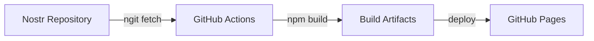

# Loom Site Mirror

This repository mirrors the Loom site from Nostr and deploys it to GitHub Pages using ngit.

## What is this?

This is a **mirror repository** that:
1. Pulls the latest Loom site code from a Nostr repository using [ngit](https://ngit.dev)
2. Builds the Vue.js application
3. Deploys it to GitHub Pages

The canonical source code lives on Nostr. This GitHub repository is just a deployment mirror.

## Setup Instructions

### 1. Fork or Create This Repository

Create a new GitHub repository with this workflow file.

### 2. Enable GitHub Pages

1. Go to repository **Settings**
2. Navigate to **Pages** section
3. Under **Source**, select **GitHub Actions**

### 3. Configure Nostr Repository

Edit `.github/workflows/deploy-from-nostr.yml` and replace `<NOSTR_REPO_NADDR>` with your actual Nostr repository naddr.

Find the line:
```yaml
ngit remote add nostr <NOSTR_REPO_NADDR>
```

Replace `<NOSTR_REPO_NADDR>` with your Nostr repository identifier (naddr format).

### 4. Trigger Deployment

**Manual deployment**:
1. Go to the **Actions** tab
2. Select "Deploy from Nostr to GitHub Pages"
3. Click "Run workflow"

**Automatic deployment** (optional):
Uncomment the schedule section in the workflow file to enable automatic syncing:
```yaml
schedule:
  - cron: '0 */6 * * *'  # Every 6 hours
```

### 5. Access Your Site

After successful deployment, your site will be available at:
```
https://<username>.github.io/<repository-name>/
```

## How It Works



1. **Sync**: GitHub Actions installs ngit and pulls latest code from Nostr
2. **Build**: Installs npm dependencies and builds the Vue.js app
3. **Deploy**: Uploads built site to GitHub Pages

## Why Use This?

- **Decentralized Source**: Code lives on Nostr, not controlled by GitHub
- **Censorship Resistant**: Even if GitHub removes the repository, the source code remains on Nostr
- **Easy Deployment**: Leverage GitHub's free hosting while maintaining Nostr as source of truth
- **Automatic Updates**: Can sync automatically on a schedule

## Troubleshooting

### Workflow Fails at ngit Installation

Check that ngit installation script is accessible:
```bash
curl -Ls https://ngit.dev/install.sh
```

### Build Fails

- Verify Node.js version compatibility (workflow uses Node 20)
- Check that `package.json` has correct dependencies
- Ensure `npm run build` works locally

### Deployment Fails

- Verify GitHub Pages is enabled in Settings → Pages
- Check workflow permissions (should be automatic)
- Review Actions logs for specific errors

### Merge Conflicts

The workflow uses `--allow-unrelated-histories` for initial sync. If conflicts persist:
1. Clone the repository locally
2. Manually resolve conflicts
3. Push to GitHub

## Configuration

### Change Sync Frequency

Edit `.github/workflows/deploy-from-nostr.yml`:
```yaml
schedule:
  - cron: '0 */6 * * *'   # Every 6 hours
  # - cron: '0 0 * * *'   # Daily at midnight
  # - cron: '0 */1 * * *' # Every hour
```

### Change Node.js Version

```yaml
- name: Setup Node.js
  uses: actions/setup-node@v4
  with:
    node-version: '20'  # Change version here
```

## Learn More

- [Loom Protocol](../loom-protocol/)
- [ngit Documentation](https://ngit.dev)
- [GitHub Pages](https://docs.github.com/en/pages)
- [GitHub Actions](https://docs.github.com/en/actions)

## License

The Loom site code is licensed under GPLv3. This mirror repository configuration is provided as-is.

---

**Note**: This is a deployment mirror. For contributing to Loom, use the Nostr repository.